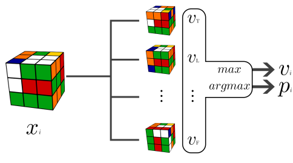
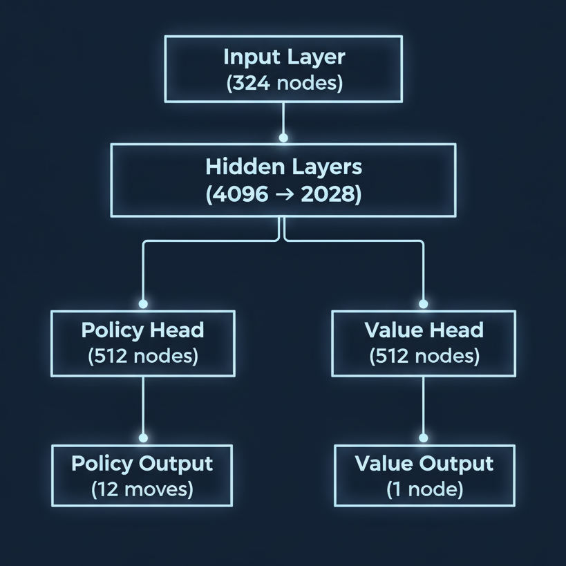
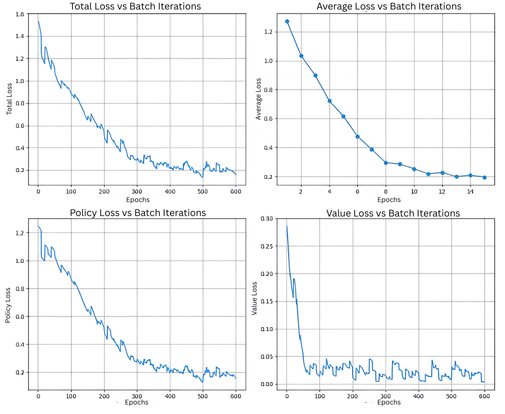

# Autodidactic Iteration: Learning Backwards from the Goal

# Abstract

Deep reinforcement learning struggles with sparse rewards, as seen in the Rubik’s Cube where only one out of 43 quintillion states is correct. Random exploration in such vast spaces rarely yields progress, leaving traditional RL without meaningful feedback. To address this, we present an implementation of Autodidactic Iteration (ADI), a method that begins from the solved state and works backward to generate its own training data. By constructing solvable examples and learning from progressively harder states, ADI demonstrates that backward learning can turn an otherwise intractable sparse-reward problem into a manageable self-supervised task, enabling efficient Rubik’s Cube solving.

# The Problem

Reinforcement learning works when there's constant feedback. But what happens with sparse rewards where success means reaching just one goal out of billions of possibilities?

The Rubik's Cube shows this perfectly. With $4.3 \times 10^{19}$ possible states and only one solution, a random attempt has probability 

$$
P(\text{random success}) = \frac{1}{4.3 \times 10^{19}} \approx 2.33 \times 10^{-20}.
$$

Even at $10^{9}$ random tries per second, you'd expect one success only every 

$$
\frac{4.3 \times 10^{19}}{10^{9} \times 3.15576 \times 10^{7}} \approx 1.36 \times 10^{3}\ \text{years},
$$

which is about 1,360 years.

Traditional RL fails because:
- **Exploration is useless**: Random actions in huge spaces lead nowhere
- **No learning signal**: When rewards are far away, which actions helped?
- **Poor convergence**: Algorithms either fail or learn to avoid trying

# The Solution: Autodidactic Iteration

If the reward is practically impossible to get randomly, why not start with the reward state itself?

**Traditional approach:**
```
Random State → Action → No feedback → ... → Goal State
```

**ADI approach:**
```
Goal State → Random Actions → Solvable States → Training Data
```

By starting from the solved cube and applying random moves, we create states that are solvable by definition. Some are close enough that even random search can solve them.

## The Math

ADI trains a neural network $f_\theta(s)$ that outputs both:

* **Value $v(s)$**: How close is this state to the solution?
* **Policy $p(s)$**: What's the best move to make?

<p align="center">
  
</p>

The learning targets are computed as:

> **Algorithm: Target Computation**
>
> For each state $s$:  
>   For each action $a$ from $s$:  
>    Compute child state $s'$  
>    $r = R(s,a)$  
>    $v' = v(s')$  
>    $Q(s,a) = r + v'$  
>   End For  
>
>   $y^v = \max_a Q(s,a)$  
>   $y^p = \arg\max_a Q(s,a)$  
>
> Return $(y^p, y^v)$

## Why It Works: The Self-Supervision Connection

ADI embodies the essence of self-supervised learning in the RL domain. Self-supervised learning is powerful because it removes the need for labeled data. Instead of relying on humans to provide answers, the model generates its own training tasks, such as predicting missing parts of an image or completing a sentence. By solving these self-created puzzles, it learns deep patterns directly from raw data. This approach allows generalization in complex settings like the Rubik's Cube, where memorizing every state is impossible, but learning the structure enables solving new scrambles.

# Implementation

## Network Architecture

**Algorithm: ADI Network Architecture**

<p align="center">
  
</p>

- Input: Cube state vector of length 324 (20×24 positions × 6 colors one-hot encoded)
- Shared layers: ELU activations
- Policy head: 12 logits, one per move
- Value head: scalar value, bounded in [-1,1] with tanh
- Output: policy logits $\pi(s)$, value estimate $v(s)$  

## Initialization

**Algorithm: Glorot Initialization**

For each linear layer $L$:  
 Initialize weights $W_L$ with Xavier (Glorot) normal distribution, gain = 0.5  
 Initialize biases $b_L = 0$  

This ensures gradients remain stable during training.  

## Training Strategy

**Algorithm: Training Optimizer Setup**

Optimizer = AdamW with parameter groups:  
 Policy head parameters: learning rate $1 \times 10^{-5}$, weight decay $1 \times 10^{-4}$  
 Value head parameters: learning rate $5 \times 10^{-5}$, weight decay $1 \times 10^{-4}$  
 Shared parameters: learning rate $1 \times 10^{-5}$, weight decay $5 \times 10^{-5}$  

## Distance-Based Weighting

**Algorithm: Weighting by Scramble Depth**

For each training example with scramble depth $d$:  

$$
w = \frac{1}{\text{max}(d, 1)}
$$

The losses get multiplied by this constant. Hence, states closer to the solution receive higher weight.  

## Training Details

- **100 epochs**  
- **1,000 scrambled cubes per epoch**  
- **20-move scramble depth**  
- **240,000 training examples per epoch** (1000 cubes × 12 moves × 20 depths)  
- **~14 hours training time**  

## Major Debugging Issues

**Overfitting**: Early versions got low loss but learned nothing. Fixed with proper learning rates and weight decay.  

**Memory issues**: Processing thousands of states exceeded GPU limits. Fixed with careful batching.  

**Gradient instability**: Training would explode or collapse. Fixed with gradient clipping (0.5 norm).  

# Results

The following plots show the training curve of our model. The total loss and policy loss steadily decrease over epochs, showing stable policy improvement. The average loss drops sharply in the early stages, indicating fast initial learning, while the value loss quickly converges and then fluctuates at a low level, reflecting accurate state-value predictions.

<p align="center">
  
</p>

# Why It Works

ADI succeeds because it:  
1. **Generates meaningful data**: Every training example is solvable  
2. **Creates natural curriculum**: Easy states first, hard states later  
3. **Provides immediate targets**: No waiting for sparse rewards  

# Applications

The backward learning principle applies beyond Rubik's Cube:

- **Drug Discovery**: Start with effective compounds, work backward through modifications  
- **Circuit Design**: Begin with good layouts, learn what makes them work  
- **Logistics**: Start with optimal plans, understand disruption handling  

# Limitations

- **High compute requirements**: Needs significant GPU resources  
- **Reversibility needed**: Works best when actions are easily undoable  
- **Hyperparameter sensitive**: Requires careful tuning of learning rates and parameters  

# Conclusion

Autodidactic Iteration (ADI) shows that starting from the goal and working backward can turn sparse-reward problems into solvable ones. By constructing solvable states and providing immediate learning signals, ADI reframes exploration as structured supervision. This backward-first principle offers a general strategy for domains where feedback is rare but reversibility exists.
