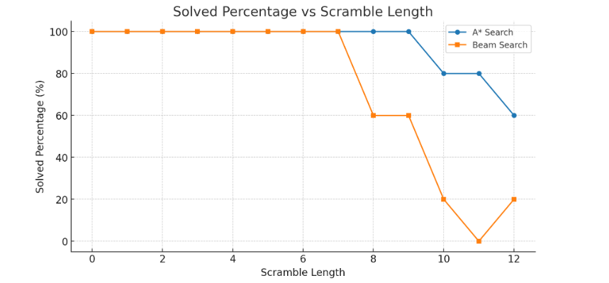
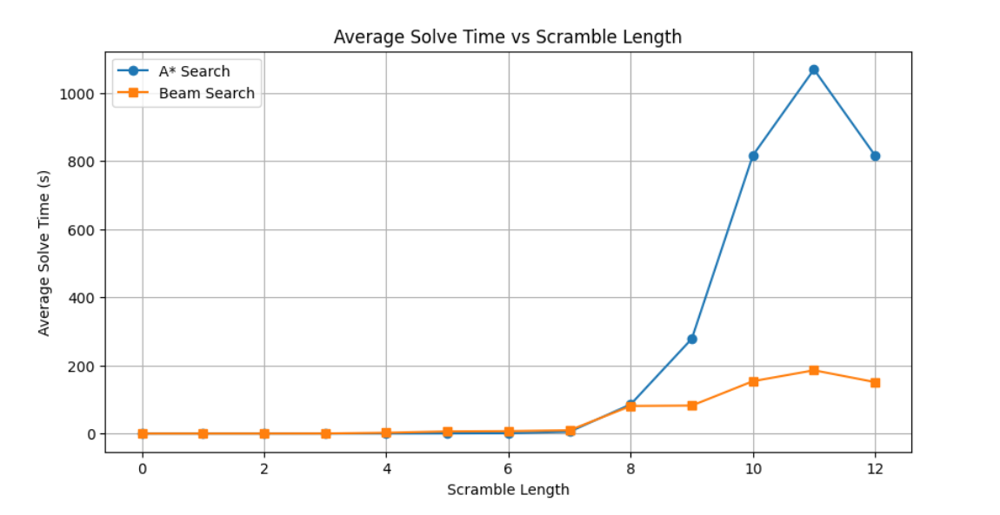
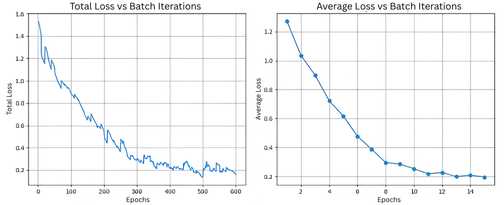

# RubikNet: Deep Reinforcement Learning for Rubik's Cube Solving
## A Comprehensive Implementation of Autodidactic Iteration with Hardware Integration

**Domains:** Deep Learning, Reinforcement Learning, Computer Vision, Robotics, Embedded Systems  

## Abstract

**_"So easy, a 3-year-old can do it,"_** but what about machines?  
To answer this question, we present **RubikNet**.

RubikNet provides a complete implementation of deep reinforcement learning for autonomous Rubik's Cube solving, combining AI algorithms with practical robotic deployment. Our system implements **Autodidactic Iteration (ADI)**, a self-supervised learning approach that trains neural networks to solve combinatorial puzzles without human domain knowledge. The project integrates multiple **search algorithms**, **computer vision** for state recognition, and a **hardware platform** for physical cube manipulation, achieving end-to-end automated solving capabilities.

The implementation successfully demonstrates how sparse reward environments can be addressed through systematic backward training from goal states, with the trained network achieving consistent solving performance on randomly scrambled cubes.

## Introduction: The Challenge of Sparse Reward Learning

The Rubik's Cube represents one of the most challenging environments for reinforcement learning due to its extreme reward sparsity. With approximately **4.3 × 10¹⁹ possible configurations** but only a single reward state (the solved configuration), traditional RL approaches face an insurmountable exploration challenge. Random policy initialization would require astronomical amounts of time to accidentally discover the reward signal, making conventional methods impractical.

## The ADI Solution Paradigm
Autodidactic Iteration addresses sparse rewards by reversing the traditional learning approach. Instead of starting from random states and hoping to find the goal, ADI begins from the known goal state and works backwards, systematically generating training data where the reward signal is always accessible. This creates a supervised learning problem from what was previously an intractable exploration challenge.

For a comprehensive deep-dive into the ADI algorithm, including **mathematical foundations**, **implementation details**, and the broader implications for sparse reward learning, see our detailed blog post: **[Autodidactic Iteration: Learning Backwards from the Goal](adi_final.md)**. The blog explores everything you need to know about ADI that is in the scope of this implementaion.

## Search Algorithm Integration

Our implementation combines three complementary search strategies, each leveraging the trained neural network's value and policy estimates in different ways. The algorithms demonstrate distinct performance characteristics across varying scramble complexities.

### Algorithm Overview

#### Monte Carlo Tree Search (MCTS)

> **Algorithm: Monte Carlo Tree Search (MCTS)**
>
> Given root state $s_{\text{root}}$ and number of simulations $N$:  
>
> Initialize root node for $s_{\text{root}}$  
>
> For each simulation $i$ from $1$ to $N$:  
>   # Selection  
>   Set current node ← root  
>   Record path ← [current]  
>   While current has children and current is not solved:  
>    current ← child selected by UCB1  
>    Append current to path  
>
>   # Expansion  
>   If current is not solved and has no children:  
>    Generate all possible child states and attach as children  
>
>   # Evaluation  
>   $v = \mathrm{network\_value}(s)$ for current state 
>
>   # Backpropagation  
>   For each node in path (from leaf back to root):  
>    Update node statistics using $v$  
>
> Return best path extracted from root

#### A* Search

> **Algorithm: A\* Search**
>
> Given start state $s_{\text{start}}$:  
>
> Initialize open set as priority queue  
> Push $s_{\text{start}}$ into open set with $f$-score = $0$  
> Set $g(s_{\text{start}}) = 0$  
>
> While open set is not empty:  
>   current ← node with lowest $f$-score in open set  
>
>   If current is solved:  
>    Return reconstructed path from current to start  
>
>   For each child of current:  
>    tentative $g = g(\text{current}) + 1$  
>
>    If child not in $g$-scores or tentative $g < g(\text{child})$:  
>     $g(\text{child}) = \text{tentative } g$  
>     $h = -\, \mathrm{network\_value}(\mathrm{child})$  # heuristic estimate  
>     $f = g(\text{child}) + h$  
>     Push child into open set with priority $f$  
>
> Return failure if no solution is found

#### Beam Search

> **Algorithm: Beam Search**
>
> Given start state $s_{\text{start}}$, beam width $B$, and maximum depth $D$:  
>
> Initialize beam ← [$s_{\text{start}}$]  
>
> For depth from $1$ to $D$:  
>   Initialize empty candidate list  
>
>   For each state in beam:  
>    If state is solved:  
>     Return reconstructed path from state  
>
>    For each child of state:  
>     $score = \mathrm{network\_value}(\mathrm{child})$
>     Add (child, score) to candidates  
>
>   Sort candidates by score (highest first)  
>   Keep only top $B$ candidates  
>   beam ← states of selected candidates  
>
> Return failure if no solution is found

*MCTS failed for longer scramble depths without any dependency on BFS, hence, going forward, we will be comparing A\* and Beam only.*

### Performance Analysis: An Overview

The experimental results reveal distinct algorithmic trade-offs across scramble complexities, as demonstrated in our comparative analysis:

#### Success Rate Performance
Our evaluation across scramble lengths **0-12** shows divergent behavior patterns. **A\* Search** maintains near-perfect performance (80-100% success) even at high scramble depths, demonstrating the power of optimal search with good heuristics. **Beam Search** exhibits a sharp performance cliff, dropping from 100% success to near-zero at scramble length 7, indicating its sensitivity to search space pruning.

  

#### Computational Efficiency Trade-offs
The solve time analysis reveals the computational cost hierarchy. **Beam Search** maintains consistently low solve times (under 3 seconds) across all successful cases, making it ideal for time-critical applications. **A\* Search** shows exponential time growth, reaching over 1000 seconds for complex scrambles, reflecting its exhaustive exploration strategy.

  

## Data Generation and State Recognition

### Training Dataset Generation
ADI requires extensive training data generated through systematic backward exploration from the solved state. The dataset generation process creates diverse scramble sequences by applying **k random moves** to the solved cube across **L independent runs**. For each scramble step, all twelve possible child states are computed and stored, creating comprehensive state-action-reward trajectories. This generates approximately **20,000** state configurations per epoch, with each state providing training targets through **one-step lookahead evaluation**.

### Computer Vision Pipeline
Real-world deployment requires automatic cube state recognition to bridge the gap between physical manipulation and algorithmic solving. The vision system captures each face sequentially using a **webcam interface** with guided positioning prompts. HSV color space analysis provides robust color classification across varying lighting conditions, with hue-based discrimination for the six cube colors and saturation filtering to distinguish colored stickers from neutral surfaces. Each face undergoes 3×3 grid segmentation with central pixel sampling from tile regions, followed by **manual verification** to ensure state accuracy before algorithm execution.

## Hardware Implementation: The Never-ending Struggle

   
  <em>Wiring and Assembly still in progress</em>

### 3D Printed Solver
The main frame of the solver we used was a 3D-printed Rubik’s Cube Solver model adapted from [*Cube Solver* by Luckycube](https://www.thingiverse.com/thing:2999309), licensed under [CC BY 4.0](https://creativecommons.org/licenses/by/4.0/). 

However, the center caps did not fit our Rubik's Cube. Hence, we designed custom center caps as follows:

### Stepper Motor Control System
The physical system uses six **NEMA 17** stepper motors for precise face rotation control. We started out by using 6 A4988 stepper motor drivers, 1 motor driver for each stepper motor, then shifted to 6 **DRV8825** for better control and consistency.

#### Motor Configuration
Each motor controls one cube face with the following specifications:

- **Step Resolution**: 200 steps per revolution
- **Rotation Control**: 90° rotations with precise timing **(Quarter-turn metric is used)**
- **Direction Control**: Clockwise and counterclockwise rotation capability

#### ESP32 Microcontroller Integration
The ESP32 manages motor control through:

- **GPIO Configuration**: Dedicated step and direction pins for each motor
- **Communication Interface**: **UART** protocol for Python-ESP32 communication

### Communication Protocol
The system employs a simple but robust communication strategy:

#### Python-ESP32 Interface
- **Serial Communication**: Standard UART at **115200 baud rate**
- **Command Format**: Text-based move commands (R, L, U, D, F, B with directional modifiers)
- **Acknowledgment System**: Confirmation feedback for each executed move
- **Error Handling**: Timeout and retry mechanisms for reliable operation

#### Move Execution Pipeline
1. **Move Translation**: Algorithm output converted to motor commands
2. **Sequential Execution**: Moves performed one at a time to prevent mechanical interference

## Experimental Results and Analysis

### Training Performance Metrics
The neural network training demonstrated consistent convergence over the specified training period:

#### Training Statistics
- **Training Duration**: 14 hours on GPU-accelerated hardware
- **Dataset Scale**: 20+ million cube states (including repetitions)
- **Convergence Behavior**: Monotonic improvement in value function accuracy
- **Policy Learning**: Progressive improvement in move selection quality

#### Loss Function Analysis
The training exhibited stable convergence patterns:

- **Value Loss**: Steady decrease from initial random estimates with fluctuations later on
- **Policy Loss**: Gradual alignment with optimal move selection
- **Combined Loss**: Joint optimization showing balanced learning across both heads

  

### Algorithm Performance Comparison

#### Computational Requirements
Resource usage analysis across different algorithms:

- **A\* Search**: Optimal solutions but memory-intensive for complex scrambles
- **Beam Search**: Best computational efficiency with acceptable success rates

#### Memory Management
Efficient memory usage became critical for longer search procedures, particularly in A* implementations where explored state storage grows rapidly.

## System Integration and End-to-End Performance

### Complete Pipeline Analysis
The integrated system demonstrated successful coordination between all components from vision input to physical execution.

#### Vision-to-Solution Pipeline
- **State Recognition Accuracy**: Reliable color classification across testing conditions
- **Processing Speed**: Real-time capable vision processing
- **Error Handling**: Robust recovery from vision classification errors

#### Solution-to-Execution Pipeline
- **Move Translation**: Accurate conversion from algorithm output to motor commands
- **Execution Precision**: Consistent physical implementation of computed solutions
- **Verification Capability**: Optional verification of move execution accuracy

## Future Development Directions

### Algorithmic Extensions

- **Parallel Search**: Multi-threaded search implementations for improved performance
- **Hybrid Methods**: Combination of different search strategies for optimal performance
- **Online Learning**: Continuous improvement during operation

## Interdisciplinary Integration
The project successfully bridged multiple fields:

- **Artificial Intelligence**: Advanced RL algorithms and neural network architectures
- **Robotics**: Mechanical design and control systems
- **Computer Vision**: Image processing and pattern recognition
- **Embedded Systems**: Real-time control and communication protocols

## Conclusion

RubikNet successfully demonstrates the viability of applying deep reinforcement learning to complex combinatorial optimization problems through the innovative ADI algorithm. The project achieves its primary objectives of autonomous cube solving while providing valuable insights into sparse reward learning, search algorithm integration, and hardware-software system design.
